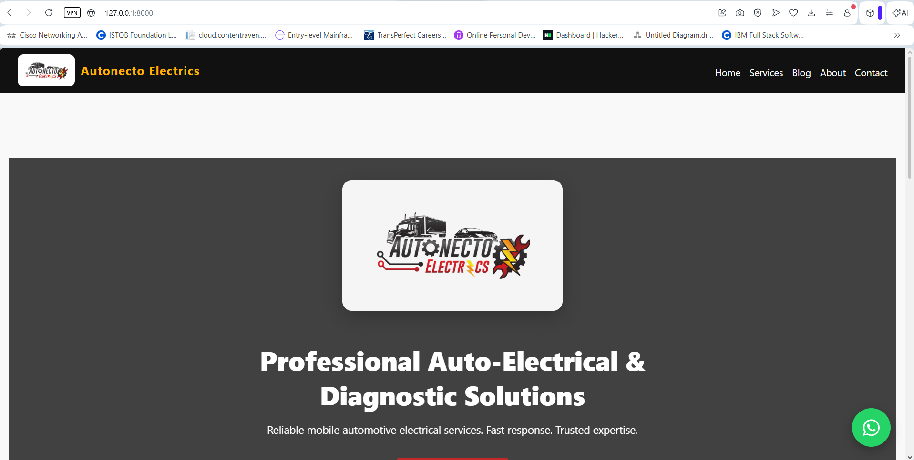
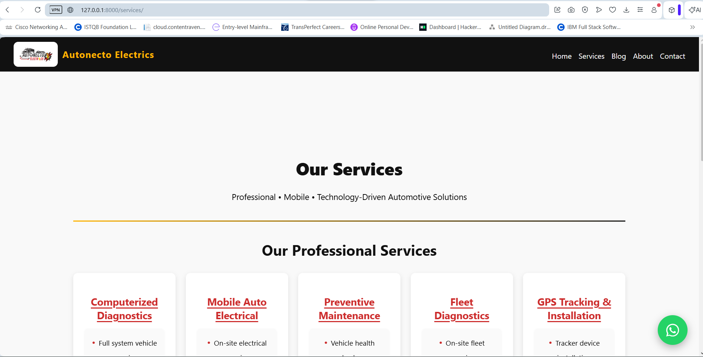
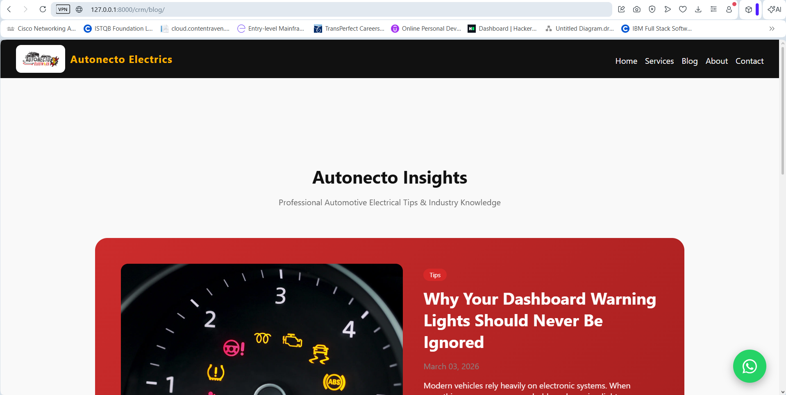
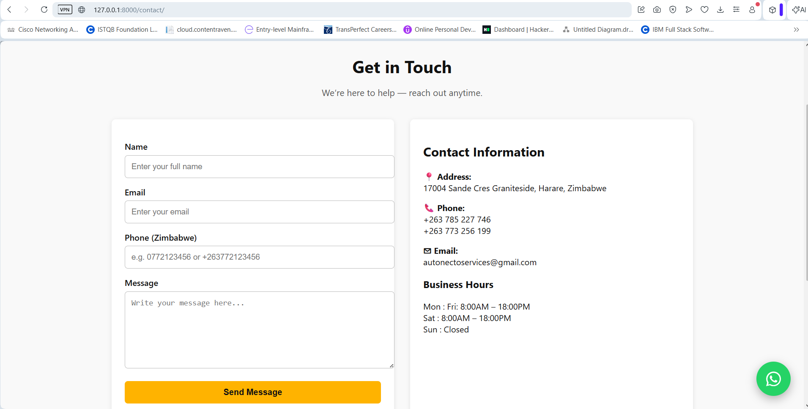

# Autonecto Electrics Website


## Overview

This project is a full-stack Django web application built for **Autonecto Electrics**, an automotive electrical and diagnostics service based in **Harare, Zimbabwe**.

I created this website for my brother’s company to help establish a professional online presence for the business. The goal was to build a clean and functional website where customers can learn about the services offered, read helpful automotive insights, and easily get in touch with the company.

While developing the project, I focused on structuring the backend using Django’s app-based architecture, keeping the code maintainable, and implementing automated testing to ensure the application works reliably.

The website currently includes informational business pages, a blog system, promotions, testimonials, and a contact form.

---

## Current Features

The project currently includes the following functionality:

Multi-app Django architecture
Business pages** (Home, About, Services, Contact)
Blog system** for automotive insights and tips
Promotions module** for special offers
Customer testimonials section
Contact form with validation
Automated tests using Pytest
Code coverage reporting
Continuous Integration using GitHub Actions

---

## Planned Improvements

Some additional features were planned during development but are currently on hold while the core website is being finalized:

Service booking functionality
Fleet management module

These features may be implemented in the future as the project continues to evolve.

---

## Tech Stack

This project was built using:

Python
Django
HTML
CSS
JavaScript
Pytest
Git & GitHub
GitHub Actions

---

## Project Structure

The project is organized using multiple Django apps to separate different responsibilities.

```
autonecto_website
│
├── apps
│   ├── pages
│   ├── services
│   ├── crm
│   ├── fleet
│   └── bookings
│
├── static
├── templates
├── .github/workflows
├── manage.py
├── pytest.ini
└── requirements.txt
```

This structure keeps the project modular and easier to maintain as it grows.

---
## Screenshots

### Homepage

<p align="center">
  
</p>

### Services Section

<p align="center">
  
</p>

### Blog System

<p align="center">
  
</p>

### Contact Page

<p align="center">
  
</p>

---


## Running the Project Locally

Clone the repository:

```
git clone https://github.com/tadiwajustice/autonecto-website.git
cd autonecto-website
```

Install dependencies:

```
pip install -r requirements.txt
```

Apply migrations:

```
python manage.py migrate
```

Run the development server:

```
python manage.py runserver
```

The site will be available at:

```
http://127.0.0.1:8000
```

---

## Running Tests

The project includes automated tests written with pytest.

Run the test suite:

```
pytest
```

Run tests with coverage reporting:

```
pytest --cov
```

Current coverage is approximately 89%

---

## Why I Built This Project

I built this project both as a real solution for a small business and as a way to improve my skills in Django and full-stack web development.

Autonecto Electrics is a growing automotive electrical service company in Zimbabwe, and building this website allowed me to apply what I’ve been learning to a real-world scenario.

Working on a real business project helped me practice:

* structuring Django applications
* designing user-friendly web pages
* implementing form validation
* writing automated tests
* using Git and GitHub for version control
* setting up CI workflows

---

## Project Status

This project is actively being developed as the official website for Autonecto Electrics.  
Some planned features such as service booking and fleet management are currently on hold while the core website functionality is finalized.

## Business Location

Autonecto Electrics  
📍 17004 Sande Crescent, Graniteside  Harare, Zimbabwe

View on Google Maps:
https://www.google.com/maps/place/Autonecto+Electrics/@-17.8648206,31.0443502,17z/data=!3m1!4b1!4m6!3m5!1s0x1931a518cb2ed5f5:0xc70842c86575067e!8m2!3d-17.8648206!4d31.0469251!16s%2Fg%2F11mdjmr390?entry=ttu&g_ep=EgoyMDI2MDMwMi4wIKXMDSoASAFQAw%3D%3D
## Written by:

**Tadiwanashe Justice Ziyambato**

Computer Engineering Student
Interested in software engineering, web development, and building practical applications that solve real-world problems.
